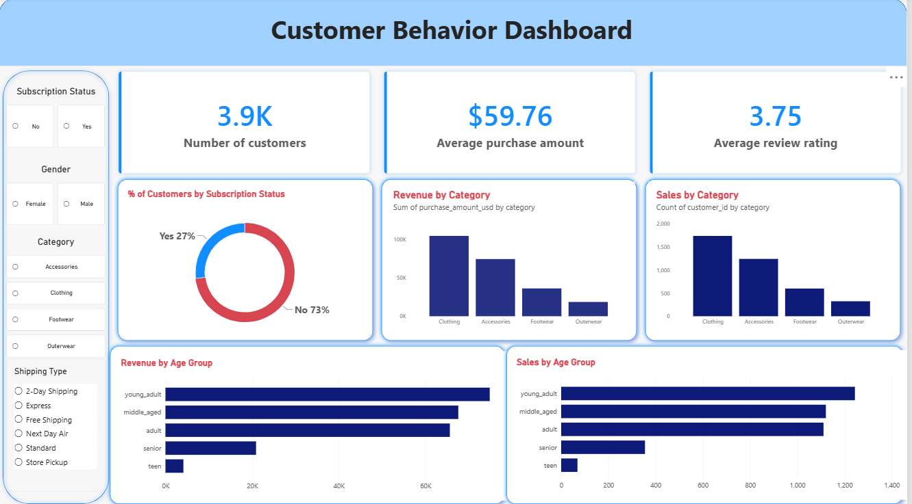

# 🛍️ Customer Shopping Behavior Analysis

An end-to-end data analysis project that turns **3,900 retail purchase records** into business insights, using **Python, MySQL and Power BI**.



---

## 📌 Project Overview

Retailers need to know who their customers are, what they buy and what drives spending. This project answers **10 business questions** about revenue, subscriptions, discounts, products and customer demographics, then presents the results in an interactive dashboard.

**Workflow:** Data preparation → SQL analysis → Business insights → Dashboard

| Step | Tool | What was done |
|------|------|---------------|
| 1. Explore & clean | Python (pandas) | Inspected the data, handled missing values, created age groups |
| 2. Analyze | MySQL | Answered 10 business questions with SQL |
| 3. Visualize | Power BI | Built an interactive dashboard with filters |

---

## 📊 Key Results

| Metric | Value |
|--------|-------|
| Customer records | 3,900 |
| Total revenue | $233,081 |
| Average purchase | $59.76 |
| Average review rating | 3.75 / 5 |
| Subscribers | 27.0% (1,053 customers) |

### Key Insights

- **Revenue follows customer volume, not spend per customer.** Men generate 67.7% of revenue, but they are 68.0% of customers. Average spend per customer is almost the same (about $59.54 male vs. $60.25 female).
- **Subscribers do not spend more.** Average purchase is $59.49 for subscribers vs. $59.87 for non-subscribers. The subscription rate stays between 26% and 28% in every spending quartile.
- **Three age groups drive revenue.** Young adults, middle-aged and adult customers generate 89.3% of revenue. Seniors (9.0%) and teens (1.8%) are under-represented.
- **Strong loyalty, little new business.** 79.9% of customers are loyal and only 2.1% are new.
- **Spending varies widely.** The top quartile spends about $90.58 per purchase, roughly 3.1x the bottom quartile ($29.14).
- **Discounts are broad.** 43% of purchases used a discount, and discount users include high spenders.

---

## ❓ Business Questions Answered

1. Which gender generates more revenue?
2. Which discount users still spend more than the average?
3. What are the top 5 products by review rating?
4. Does average spending differ by shipping type?
5. Do subscribers spend differently from non-subscribers?
6. Which 5 products rely most on discounts?
7. How many customers are new, returning or loyal?
8. What are the top 3 most purchased products in each category?
9. Which age groups generate the most revenue?
10. How does subscription status vary across spending quartiles?

---

## 🧰 Skills Demonstrated

- **SQL (MySQL):** aggregations (`SUM`, `AVG`, `COUNT`), `GROUP BY`, subqueries, `CASE` segmentation, and window functions (`RANK`/`ROW_NUMBER`, `NTILE`)
- **Python (pandas):** data profiling, missing-value imputation, feature engineering
- **Power BI:** KPI cards, charts, slicers and dashboard layout
- **Business analysis:** turning query results into clear, actionable insights

---

## 🧹 Data Preparation

- **Missing values:** 37 review ratings (0.95%) were filled with the median rating of each product category.
- **Column names:** standardized to lowercase with underscores for use in MySQL.
- **Age groups:** created teen, young adult, adult, middle-aged and senior groups.
- **Purchase frequency:** converted into approximate days between purchases.

---

## 📈 Power BI Dashboard

The one-page **Customer Behavior Dashboard** includes:

- **KPI cards:** number of customers, average purchase amount, average review rating
- **Charts:** subscription mix, revenue and sales by category, revenue and sales by age group
- **Slicers:** subscription status, gender, category, shipping type

> The discount, product-rating, segmentation and quartile analyses are in the SQL part of the project and are covered in the full report.

---

## 💡 Recommendations

1. **Acquire new customers.** Only 2.1% of customers are new. Target women especially: they spend as much per customer as men but are only 32% of the base.
2. **Rework the subscription offer.** Subscribers do not spend more, so add benefits that raise basket size or purchase frequency.
3. **Grow seniors and teens.** They generate only 9.0% and 1.8% of revenue.
4. **Review discount strategy.** Test whether selective discounting protects margin without hurting sales.

---

## ⚠️ Limitations

- The data shows association, not causation (for example, discounts and spending).
- Income, marketing exposure and pre-discount prices are not available.
- Results apply to this dataset of 3,900 records only.
- Some fields were transformed (imputed ratings, approximate purchase frequency).

---

## 📁 Repository Structure

```
├── README.md
├── images/
│   └── dashboard.png
├── data/            # cleaned dataset
├── notebooks/       # Python data exploration and cleaning
├── sql/             # MySQL queries (10 analyses)
├── dashboard/       # Power BI file (.pbix)
└── report/          # Full analysis report (.docx)
```


---

## 👤 Author

**[Vuong]**
[LinkedIn](www.linkedin.com/in/minh-vuong-luong-128b97368)  · [Email](mailto:minhvuongluong2006@example.com)
